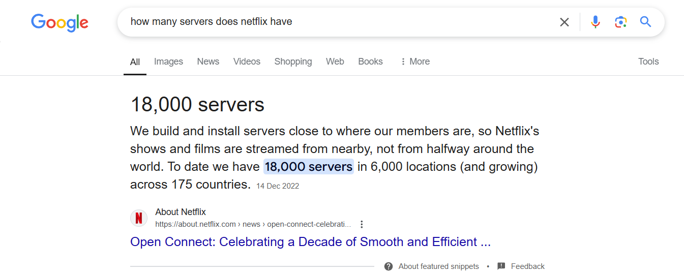

# **Introduction to Orchestration**

## **Overview**

In this lesson, you will understand orchestration and its importance in modern software systems. You will also look into how orchestration tools are helpful in container orchestration.

## **Lesson Outcomes**

By the end of this lesson, you will:

- Understand orchestration in the context of containerized applications
- Identify the challenges involved in managing containers at scale
- Learn how Orchestration tools provides an easy and automated way for container orchestration.

## **Explanation**

Let’s start with a quick basic.

So you know Docker or any other containerization tool allows you to package an application along with its dependencies (libraries, binaries, configuration files, etc.) into a lightweight, portable unit called containers.

Now, imagine you are using Docker containers to run, say an e-commerce application. The application architecture looks something like this:

- Frontend Service
    - Written in React, a Frontend Framework having its own dependencies
- User Service
    - Functions to handle operation relation to users.
    - Written in Java 11, along with its dependencies
- Product Service
    - Functions to handle operation relation to users.
    - Written in Java 18, with its own dependencies/libraries
- Order Service
    - Functions to handle operation relation to users.
    - Written in Python, with its own dependencies/libraries

Due to their conflicting dependencies, you will want to run these microservices in separate containers.

### **The Problem with Multiple Containers**

1. **Manual Management**: You must individually start, stop, and monitor each container.
2. **Networking**: How does the web server (Nginx) communicate with the database? You need to configure container networking manually.
3. **Scaling**: What if you need to run multiple instances of Nginx to handle more traffic? You’d need to manually start and balance traffic across instances.
4. **Recovery**: If a container crashes, you need to monitor and restart it yourself.

Managing just four containers is still feasible, but what if you have dozens or hundreds?

Netflix has like 18000 servers, do you think manually managing that huge amount of servers is feasible?

### **The Need for Orchestration**

When you scale up to tens, hundreds, or thousands of containers, you need:

- **Automation**: For deployment, scaling, and recovery.
- **Load Balancing**: To distribute traffic across containers.
- **Resource Management**: Efficient use of CPU, memory, and storage.
- **High Availability**: Ensure uptime by detecting and replacing failed containers.

### **What is Orchestration?**

Orchestration refers to the automated arrangement, coordination, and management of complex computer systems, middleware, and services. In the context of containers, it ensures your applications are deployed, scaled, and maintained effectively.

To help you with the above challenges orchestration tools come in!

### **How Orchestration Tools Solve These Problems**

Orchestration platforms/tools automate the deployment, scaling, and management of containers across clusters of machines.

- **Scaling**: They automatically adjust the number of running containers based on demand.
- **Self-Healing**: If a container crashes, they restart it.
- **Load Balancing**: They distribute incoming traffic across healthy containers.
- **Multi-Node Support**: They can manage containers across multiple machines.

## Suggested Reading
- [Container Orchestration](https://cloud.google.com/discover/what-is-container-orchestration?hl=en)
