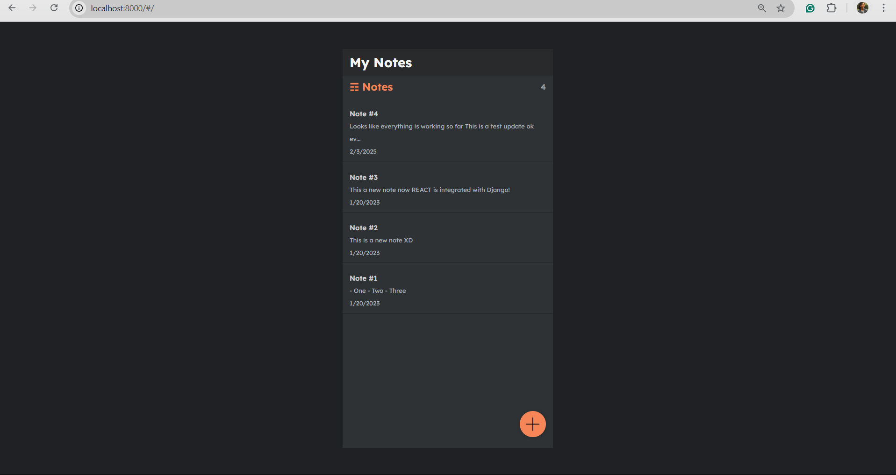

# **Project Title: Django Notes App on Minikube (Windows Environment)**

## **Project Overview**

In this project, you will deploy a **Django-based Notes application** on a **local Kubernetes cluster** running on **Windows** using **Minikube**. The goal is to familiarize yourself with key Kubernetes concepts such as **Deployments** and **Services**, and to explore how to containerize and deploy a Django application within a Kubernetes environment. The final application will provide basic CRUD (Create, Read, Update, Delete) functionality for managing notes.

### **End Goal**

The end goal is to successfully deploy the Django Notes application on **Kubernetes** running locally on your Windows machine. You will be able to expose the application via a Kubernetes service and ensure it is accessible on your local machine.

## **Pre-requisites**

Ensure you have the following tools installed and configured on your Windows system:

1. **Windows 10/11** (Pro or Enterprise)
2. **Docker Desktop for Windows** (with **WSL 2** integration)
3. **Minikube** installed
4. **kubectl** for interacting with Kubernetes clusters
5. Basic knowledge of **Docker**, **Kubernetes**, and **Django** (optional)

## **Outcomes**

Upon completing the project, you will:

- Set up **Minikube** on Windows and configure **kubectl** for local cluster management.
- Deploy a **Django Notes Application** to Kubernetes, following the key Kubernetes principles.
- Expose the Django app through a **Kubernetes Service** to make it accessible externally.
- Gain practical experience in deploying applications to a local Kubernetes environment.

## **Project Description**

This project involves deploying a simple **Django Notes application** to a **Kubernetes** environment using **Minikube**. The app will expose a REST API for managing notes. You will apply key Kubernetes concepts, including **Deployments** and **Services**, and you will interact with a local Minikube cluster to manage your application. 

### **Application Architecture**

1. **Frontend:**
   - Django framework used for creating a REST API for note management (CRUD functionality).
   
2. **Backend:**
   - The Django application will be containerized using **Docker**.

3. **Kubernetes:**
   - Kubernetes environment running on **Minikube**.
   - **Deployment** to manage application replicas.
   - **Service** to expose the application.

---

## **TASKS**

### **1. Set Up Development Environment**

- Install and configure the necessary tools, including **Docker Desktop**, **Minikube**, and **kubectl**, on your Windows system.
- Ensure **Minikube** is running and properly configured to use the **Docker** driver on your Windows machine.

### **2. Set Up the Minikube Cluster**

- Start a new **Minikube** cluster on your Windows machine.
- Set up a **Kubernetes namespace** for the Notes application to ensure resource isolation within your cluster.

### **3. Containerize the Django Application**

- Package the Django Notes application into a **Docker container**.
- Ensure the Docker container is configured to run the Django application on the appropriate port. You can find the django application for the notes-app at docker hub : `simkum123/note-app:latest`

### **4. Deploy the Django Application to Kubernetes**

- Create a **Kubernetes Deployment** to manage the deployment of the Django Notes application.
- Set up the necessary configurations, including the number of replicas to ensure high availability and scaling.
  
### **5. Expose the Application via Kubernetes Service**

- Define a **Kubernetes Service** to expose the Django application externally, allowing access to the app from your local machine.

### **6. Verify the Deployment and Service**

- Confirm that the deployment is successful and the application is running by checking the status of the deployment and the service in Kubernetes.
- Ensure the Django application is accessible via the defined Kubernetes service.

### **7. Clean Up the Resources**

- After testing the deployment, clean up the Kubernetes resources to avoid unnecessary consumption of resources.
- Delete the Kubernetes deployment, service, and namespace associated with the project.

## Submission Guidelines
- Submit the yml files for deployment and service creation
- Screenshot of the note-app accessible on local machine

The above need to be uploaded to google drive with accessibility set as `Anyone as Viewer`